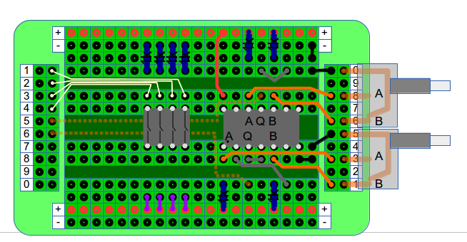

= Presentazione

A questo punto devi dire chi sei e cosa fai, quali obiettivi ti proponi, ecc.ecc.
Vorrei pubblicare i miei progetti su github per condividerli con gli altri.

== Prove markup asciidoc

Se non è sufficiente puoi proseguire qui, per il momento puoi _provare_ la formattazione *asciidoc*, se va bene.

Un paragrafo e tante belle parole. Un paragrafo e tante belle parole. Un paragrafo e tante belle parole. 

       Un paragrafo e tante belle parole. Un paragrafo e tante belle parole. 
       Un paragrafo e tante belle parole. Un paragrafo e tante belle parole. 

       
metti qui un'illustrazione

Inserimento illustrazioni: (millefori:images/millefori.png[])
Prosegue il discorso con altri esempi:

.millefori block image

== Formule?
Vedi se questa funziona:

asciimath:[`x/x={(1,if x!=0),(text{undefined},if x=0):}`]

e adesso prova questa:

latexmath:[$\sum_{n=1}^\infty \frac{1}{2^n}$]

e questa:

Red [red]+++`sum_(i=1)\^n i=(n(n+1))/2`$+++ AsciiMathML formula

e questa:

\frac{n!}{k!(n-k)!}

== Il codice

[source,C]
--
/*
 * example_1-1.c
 * 
 * Copyright 2014 tiziano <tiziano.detogni@gmail.com>
 * 
 */
#include <stdlib.h>
#include <stdio.h>

/*
 * This is the "declaration".
 */
void show_message(void);       // anche questo è un commento, nessuno che lo dice???
                               // no, dato che è un commento C++, gcc lo accetta ma è 
                               // sconsigliato...

/*
 * This is now a "definition".
 */
void show_message(void){
    printf("hello\n");
}

int main() {
    int count;
    count = 0;
    while(count < 10) {
        show_message();
        count = count + 1;
    };

    exit(0);
}
--
