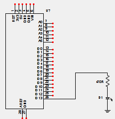

= Blink 
:lang: it
:author: Tiziano
v1.0, 07-feb-2017
:doctype: article
:backend: xhtml11
:stylesdir: $HOME/.asciidoc/themes/tiz
:theme: tiz
:toc2:
:toclevels: 5
//:theme: volnitsky

//
//  barra di navigazione
//
[[navbar]]
********
// posizione svg
+++++
<svg aria-hidden="true" class="octicon octicon-mark-github" style="float:left;padding-right:10px;" height="16" version="1.1" viewBox="0 0 16 16" width="16"><path d="M8 0C3.58 0 0 3.58 0 8c0 3.54 2.29 6.53 5.47 7.59.4.07.55-.17.55-.38 0-.19-.01-.82-.01-1.49-2.01.37-2.53-.49-2.69-.94-.09-.23-.48-.94-.82-1.13-.28-.15-.68-.52-.01-.53.63-.01 1.08.58 1.23.82.72 1.21 1.87.87 2.33.66.07-.52.28-.87.51-1.07-1.78-.2-3.64-.89-3.64-3.95 0-.87.31-1.59.82-2.15-.08-.2-.36-1.02.08-2.12 0 0 .67-.21 2.2.82.64-.18 1.32-.27 2-.27.68 0 1.36.09 2 .27 1.53-1.04 2.2-.82 2.2-.82.44 1.1.16 1.92.08 2.12.51.56.82 1.27.82 2.15 0 3.07-1.87 3.75-3.65 3.95.29.25.54.73.54 1.48 0 1.07-.01 1.93-.01 2.2 0 .21.15.46.55.38A8.013 8.013 0 0 0 16 8c0-4.42-3.58-8-8-8z" fill-rule="evenodd"></path></svg>
+++++
link:../index.html[Tizziano]
********

[NOTE]
    Questa pagina è attualmente in fase di costruzione. Si tratta di un testo 
    di prova che ha l'obiettivo di esemplificare alcuni aspetti per la 
    redazione di un articolo tecnico con minimo sforzo e massimo (possibile) 
    risultato.

Questa pagina illustra come far lampeggiare un led con la scheda footnote:[ 
Mettere sempre prima del nome 'Arduino' se si tratta della scheda, dell'IDE, 
della libreria, della comunità, del Primo Re d'Italia, del vicino di casa, o di 
qualsiasi altra cosa possa essere chiamata Arduino). Una questione di stile.] 
Arduino.  

== Introduzione

In questo esempio, vengono utilizzati un led e una resistenza limitatrice di 
corrente collegati come illustrato nel seguente schema elettrico. Uno dei pin 
digitali della scheda Arduino, configurato come uscita viene collegato alla 
resistenza limitatrice, in configurazione 'current source' footnote:[('note a 
piedipagina in una pagina HTML, possono evere un senso?') Sorgente di corrente, 
la corrente esce dal pin. Contrapposto alla configurazione 'Current sink', 
Assorbimento di corrente, dove la corrente entra nel pin]. 

Scarica: link:files/blink.png[*immagine*]  link:files/blink.pdf[*pdf*] 

La resistenza di 470 Ohm svolge una doppia funzione. Limitare la corrente 
erogata dal processore e conseguentemente ridurre la corrente che accende il 
led. Essendo la tensione in uscita di 5 Volt, l'assorbimento in corrente è pari 
a 0,011 Ampere (11 mA). 
-----
    Se si volesse avere un margine di sicurezza maggiore si potrebbe usare una 
    resistenza da 1K Ohm, ottenendo un assorbimento inferiore, pari a 5 mA. Con 
    una conseguente riduzione di luminosità del led.
-----

== Il software

Come possono esserci diversi modi per eseguire i collegamenti di uno schema 
elettrico, così  possiamo scrivere il programma che lo controlla in altrettanti 
modi differenti.

[NOTE]
    Ci sono due modi per illustrare il software. Sbattere sulla pagina un 
    listato chilometrico e pretendere che qualcuno lo legga. Oppure costruire 
    passo passo il listato da zero (vedi dean camera). Il secondo approccio mi 
    sembrerebbe migliore, ma molto più faticoso.

Sulla pagina http://arduino.cc/en/Tutorial/Blink, molto simile nella sostanza a 
questa, è possibile vedere un esempio molto semplice che mostra come 
lampeggiare il led. Tuttavia esistono molti modi differenti per ottenere lo 
stesso risultato. Come al solito, in un esempio come questo, il software è 
molto semplice. Lo si può scaricare a questo indirizzo 
link:files/blink.ino[*blink.ino*]:

[source,c]
-----
/*
  Blink
  Turns on an LED on for one second, then off for one second, repeatedly.
*/

#define pinLed 13
#define DEBUGSERIALno

void blinkled(int pin, unsigned long blinkdelay) {
  static unsigned long time=0;
  static int state = HIGH;

  if ( (millis()-time) > blinkdelay ) {
        time=millis();
                //  condition ? thenstatement: elsestatement;
        state = (state == LOW) ? HIGH: LOW;
        digitalWrite(pin, state);   // sets the LED on
        
        #ifdef DEBUGSERIAL
          if (state == LOW) Serial.println("blink");
        #endif
  };
  return;
}

void setup() {
  // Pin 13 has an LED connected on most Arduino boards:
  // initialize digital pin 13 as an output.
  pinMode(pinLed, OUTPUT);

  #ifdef DEBUGSERIAL
    // 300, 600, 1200, 2400, 4800, 9600, 19200, 38400, 57600, or 115200
    Serial.begin(57600);  
    Serial.println("blink startup");
  #endif
}

void loop() {
    blinkled(pinLed, 1000);
}
-----

todo::
    spiega pedanticamente il software.

== Riepilogo

todo::
    adesso spiega cosa si è fatto, i risultati ottenuti e i possibili sviluppi

